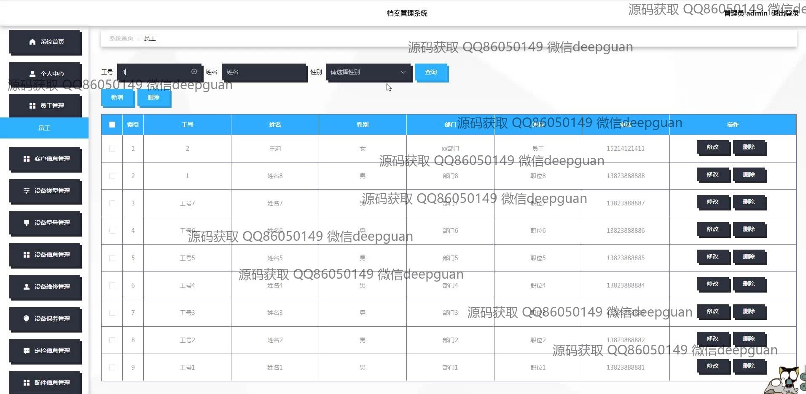

<h1 align="center">档案管理系统</h1>

## 简介
档案管理系统：角色分为管理员和员工；提供用户登录和注册、员工信息管理、设备信息管理、客户信息管理、合同管理、配件信息管理和设备维修管理功能，实现档案的高效管理与维护。    --计算机毕业设计源码；毕设源码；java毕业设计源码

## 联系方式

<h3 align="center">获取完整代码与数据库文件 + 微信：deepguan QQ: 86050149 QQ群: 783742310</h3>

<h3 align="center">可帮忙远程部署 包运行成功！提供远程部署、修改代码、设计文档指导、代码讲解等服务！</h3>

## 功能介绍（完整见运行截图）
管理员：管理员可以通过系统进行用户登录和注册控制，管理档案系统的各种设置，包括员工管理、客户信息管理、设备信息管理和合同信息管理等模块。管理员能够查看和编辑用户和员工信息，进行合同信息的上传和修改，通过设备管理模块录入、修改、删除设备相关信息，进行设备维修信息的记录和追踪。管理员还可以访问档案管理系统首页，管理网站整体布局和功能，确保系统各模块的正常运作和数据的安全性。

员工：员工可以在系统中进行登录以访问个人相关模块。员工能够查看和管理自己的个人信息，通过客户信息管理模块进行客户数据的添加、修改和删除操作，还可以监控和录入设备信息。在设备维修信息模块中，员工可以记录和查看设备的维修历史，确保设备的正常运行。员工有权限管理与他们相关的合同信息，能够查看、填写合同表单并上传相关合同文件，为业务操作提供便利。

客户：客户能够通过系统进行注册和登录操作，以访问与自身相关的信息模块。客户可以使用客户信息管理界面，录入或更新公司名称、联系方式等基本信息，还能够通过合同信息管理模块，查看涉及自身的合同信息，包括合同条款、签订日期等。客户可以浏览系统生成的各种设备管理信息，如设备型号、状态、保养日期等。保持设备信息更新与准确，确保服务质量和透明性。

访客用户：访客用户在未注册或登录状态下，有限制地浏览系统的一些公共信息模块，如档案管理系统主页、功能布局等。尽管访客用户无法进行信息录入、编辑或查看私人数据，但他们可以了解本系统的基本功能和模块划分，为后续注册或与企业合作奠定基础。通过首页展示的介绍和功能概览，访客用户对系统的安全性和便捷性有初步的认知，提高系统的推广效果。

## 运行截图

本代码来源于网络,仅供学习参考使用!

